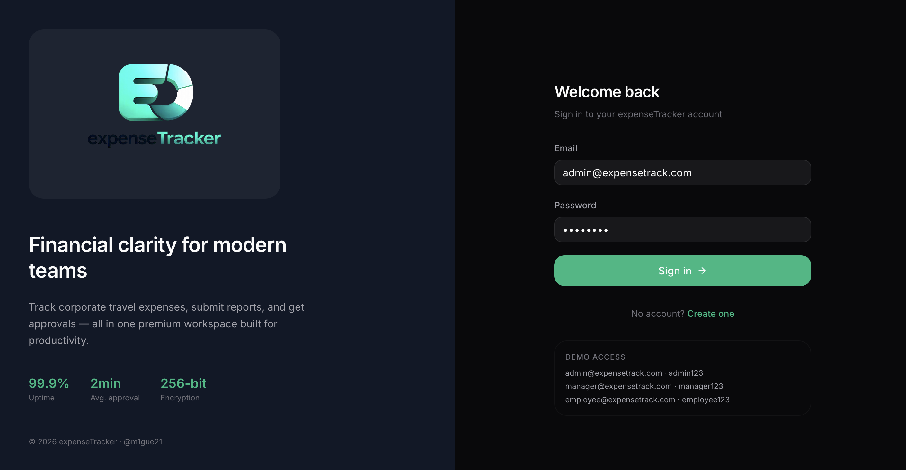
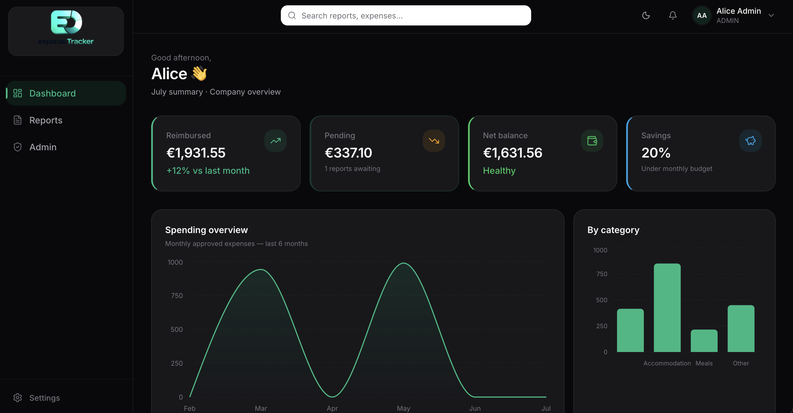
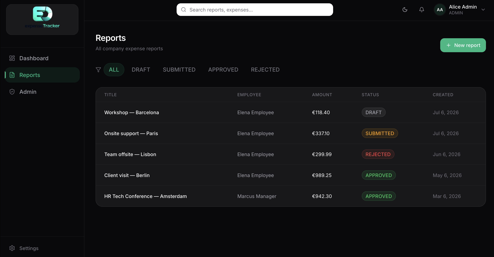
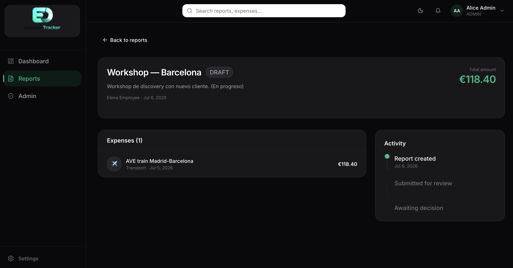
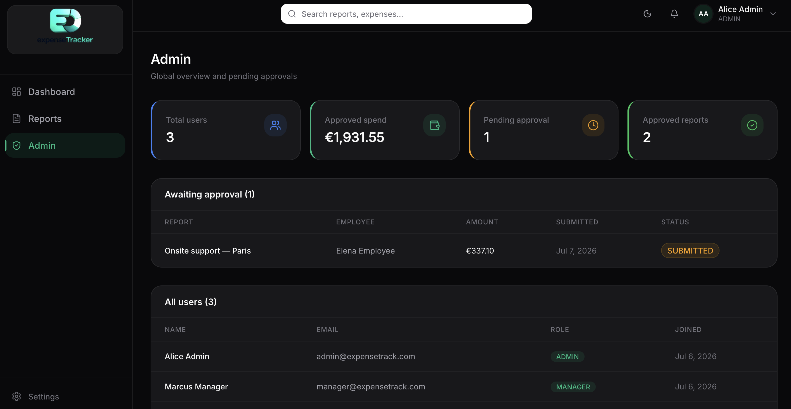

# ExpenseTrack — Frontend

> Next.js web app for corporate expense management.
> Part of the [ExpenseTrack](https://github.com/m1gue21/expenseTrack) portfolio by [@m1gue21](https://github.com/m1gue21).


## Related repos

- [expenseTracker-backend](https://github.com/m1gue21/expenseTracker-backend) — Kotlin/Spring Boot API
- [expenseTracker-mobile](https://github.com/m1gue21/expenseTracker-mobile) — Flutter mobile app

## Screenshots

### Login


### Dashboard


### Reports


### Report detail


### Admin panel


## Getting started

Requires the [backend](https://github.com/m1gue21/expenseTracker-backend) running on port 8080.

```bash
npm install
npm run dev    # http://localhost:3000
```

## Test credentials

| Role | Email | Password |
|------|-------|----------|
| ADMIN | admin@expensetrack.com | admin123 |
| MANAGER | manager@expensetrack.com | manager123 |
| EMPLOYEE | employee@expensetrack.com | employee123 |
